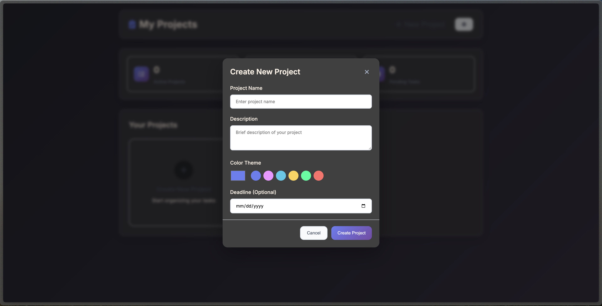
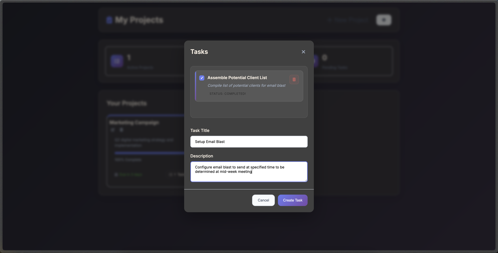
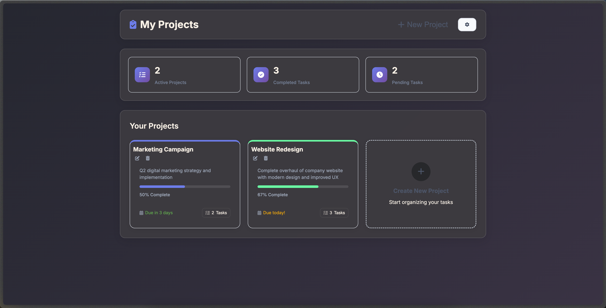

# todo-list
TOP #11: Todo List

Apply OOP principles to create dynamic todo list app

Adhere to SOLID principles and best practices for structure of classes and methods

Utilize localStorage API to keep track of saved projects on user's computer

New Project Modal

New Task for Project

Projects View with Task Completion Progress Bars and Summary

